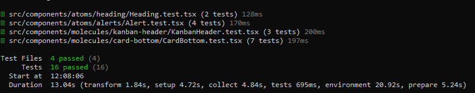
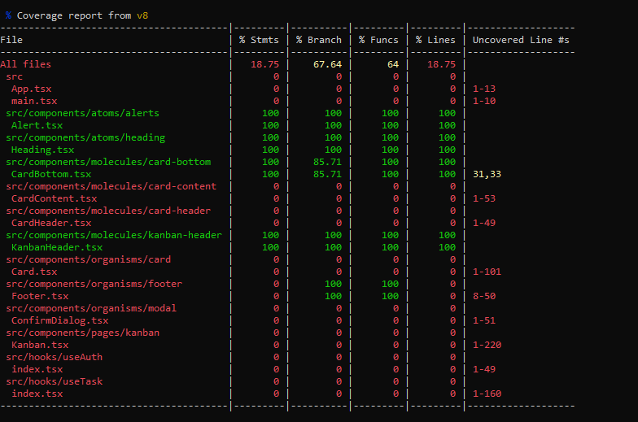

# Variáveis de ambiente modo DEV (Porta 5114)

```sh
Linux:
export VITE_APP_BASE_URL="http://localhost:5114"
export VITE_APP_USERNAME="some username"
export VITE_APP_PASSWORD="some password"

Windows:
set VITE_APP_BASE_URL="http://localhost:5114"
set VITE_APP_USERNAME="some username"
set VITE_APP_PASSWORD="some password"
```

# Variáveis de ambiente modo DOCKER (Porta 8086)

```sh
Linux:
export VITE_APP_BASE_URL="http://localhost:8086"
export VITE_APP_USERNAME="some username"
export VITE_APP_PASSWORD="some password"

Windows:
set VITE_APP_BASE_URL="http://localhost:8086"
set VITE_APP_USERNAME="some username"
set VITE_APP_PASSWORD="some password"
```


### Inicializando o frontend em modo desenvolvimento
Não esquecer de informar o conteúdo das variáveis no arquivo "env.dev"
Então execute o comando abaixo
```sh
npm i
npm run dev
```

### Usando lint
```sh
npm i
npm run lint
npm run lint:fix
```

### Usando vitest e vitest coverage
Executando tests
```sh
npm run test
```


Executando test:coverage
```sh
npm run test:coverage
```


### Build da imagem docker com execução local do container
Não esquecer de informar o conteúdo das variáveis no arquivo "env.docker"
Então execute o comando abaixo
```sh
npm i
npm run docker:full
```

### Deploy para "docker hub"
```sh
docker login
docker tag kanban-app-front:1.0.0 renatomatos79/kanban-app-front:1.0.0
docker push renatomatos79/kanban-app-front:1.0.0
```

### Usando imagem do Docker Hub
```sh
npm run docker:run:hub
```