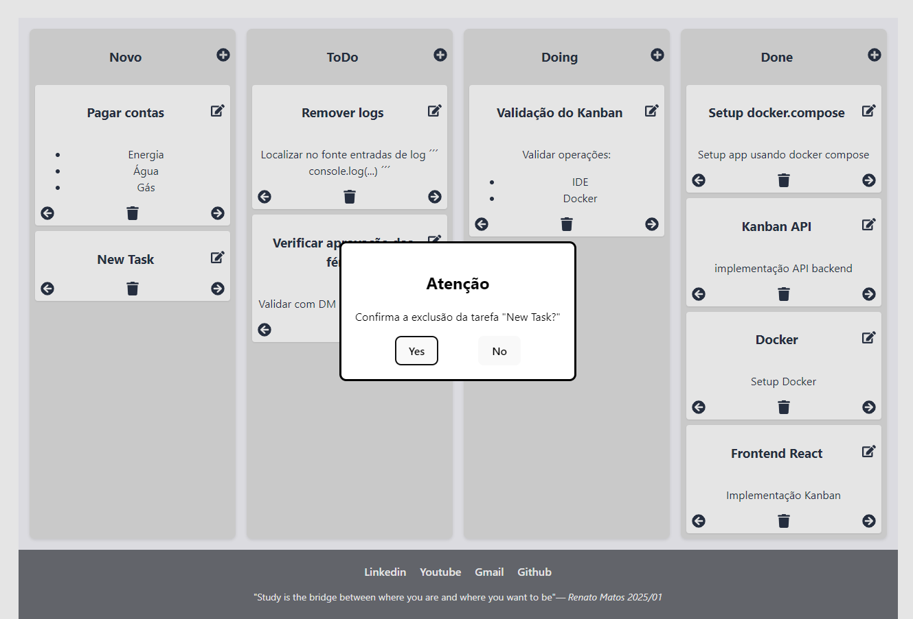

# Sobre o repositorio
Este projeto contem as seguintes pastas
- FRONT: App kanban feita em React@18


- BACK: Api para gestao do Kanban usando .NET Core 8 / Redis
```sh
(POST)      http://0.0.0.0:8086/login/

(GET)       http://0.0.0.0:8086/cards/
(POST)      http://0.0.0.0:8086/cards/
(PUT)       http://0.0.0.0:8086/cards/{id}
(DELETE)    http://0.0.0.0:8086/cards/{id}
```

# Antes de executar o docker compose
O projeto frontend esta sendo publicado em um container docker
usando nginx:alpine. Portanto, e preciso primeiro realizar o build
da aplicacao frontend para criacao da pasta "dist" e com isso 
sera entao possivel inicializar o "docker-compose".

# Build rapido do frontend
- Acesse a pasta FRONT
- Instale os pacotes
- Build a aplicacao
```sh
cd FRONT
npm i
npm run build:dist
```

# Inicializando frontend / backend / redis
```sh
docker-compose up -d --build
```


